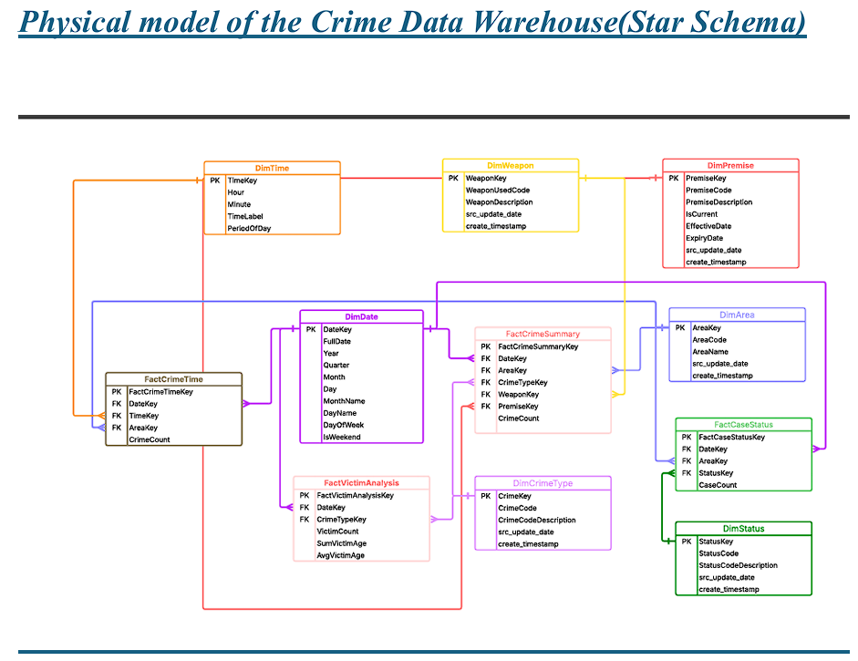
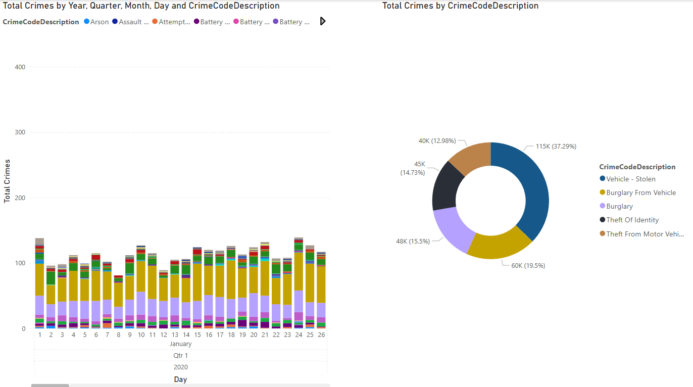

# Crime Data Warehouse Project

## 📊 Overview

This repository contains an **end‑to‑end data‑warehouse solution** built on the Los Angeles crime dataset from Kaggle.  The project walks through every step of the classical Kimball lifecycle:

1. **Source analysis** of the OLTP schema.
2. **Dimensional modelling** around the analytical KPIs.
3. **ETL / ELT pipelines** implemented in **SQL Server Integration Services (SSIS)**.
4. **Analytical queries & KPIs** for insight extraction.
5. **Deployment & scheduling** with SQL Server Agent.
6. **Interactive dashboard** in **Power BI**.

> **Dataset**: [https://www.kaggle.com/datasets/shubhrarana/crimedatasetla](https://www.kaggle.com/datasets/shubhrarana/crimedatasetla)

---

## 🚀 KPIs

|  #  | Business Question        | KPI                              | Grain              |
| :-: | ------------------------ | -------------------------------- | ------------------ |
|  1  | Crime volume across L.A. | `CrimeCount`                     | One crime event    |
|  2  | Victim demographics      | `AvgVictimAge`, `VictimCount`    | Date × Crime Type  |
|  3  | Temporal patterns        | Distribution per **hour bucket** | Date × Time Slice  |
|  4  | Case follow‑up           | % cases           | Date × Case Status |
|  5  | Weapon analysis          | Incidents by weapon type         | Date × Weapon      |

Full KPI matrix lives in **Project Details.pdf §3**.

---

## 🗄️ Dimensional Model

* **Dimensions (6)**: `DimDate`, `DimTime`, `DimArea`, `DimCrimeType`, `DimWeapon`, `DimPremise`
* **Facts (4)**

  * `FactCrimeSummary`  — *periodic*
  * `FactVictimAnalysis` — *periodic*
  * `FactCrimeTime`      — *periodic*
  * `FactCaseStatus`     — *periodic*



For detailed metadata (surrogate keys, data‑types, slowly‑changing attributes), see **Dim\&Facts.sql** and **Project Details.pdf §3‑f**.

---

## 🏗️ Repository Layout

```text
├── Packages/
│   ├── DimensionTime.dtsx
│   ├── LoadAllDimensions.dtsx
│   ├── LoadAllFacts.dtsx
│   ├── LoadAllStagingTables.dtsx
│   ├── Load_All_Tables_from_src.dtsx
│   └── Master.dtsx         <-- orchestrates complete workflow
│
├── Analysis-Queries.sql     -- example BI queries
├── Dim&Facts.sql            -- DWH DDL
├── PowerBI.pbix             -- Multiple pages designed in power BI
├── LoadFromSrc.sql          -- source‑system DDL
├── Staging.sql              -- staging‑area DDL
├── Project Details.pdf      -- full report (scroll below!)
└── README.md                -- this file
```

<!-- ---

## ⚙️ How to Reproduce

1. **Clone & open** the solution in **Visual Studio 2019+** with SSIS extensions.
2. Execute `LoadFromSrc.sql`, `Staging.sql`, then `Dim&Facts.sql` on your SQL instance (`CrimeDB`).
3. In **SSIS**:

   1. Edit `Project.params` → point **`SrcFolder`** & **connection strings** to your environment.
   2. Run **Master.dtsx** (F5) — this will:

      * load raw CSV → `Packages/Load_All_Tables_from_src.dtsx`
      * populate **staging**
      * load **dimensions**, then **facts**, in dependency order.
4. Deploy to **SSIS Catalog** (`SSISDB`) → folder **Crime**.
5. Execute `Deployment/CrimeJob.sql` to create a SQL Agent job that schedules nightly loads.
6. Open `PowerBI/CrimeDashboard.pbix`; press **Refresh** to pull the warehouse tables. -->

---

## 🔍 Example Insight Query

```sql
/* Top‑5 areas by bike thefts in 2024 */
SELECT a.AreaName, SUM(f.CrimeCount) AS Incidents
FROM FactCrimeSummary f
JOIN DimCrimeType ct ON ct.CrimeCode = '502' -- Bike ‑ Stolen
JOIN DimArea a       ON a.AreaKey  = f.AreaKey
JOIN DimDate d       ON d.DateKey  = f.DateKey
WHERE d.Year = 2024
GROUP BY a.AreaName
ORDER BY Incidents DESC;
```

---

## 🖥️ Dashboard Preview



See **Project Details.pdf** for annotated screenshots.

---

## 📄 Full Report (scroll)

<iframe src="Project Details.pdf" width="100%" height="600px"></iframe>
